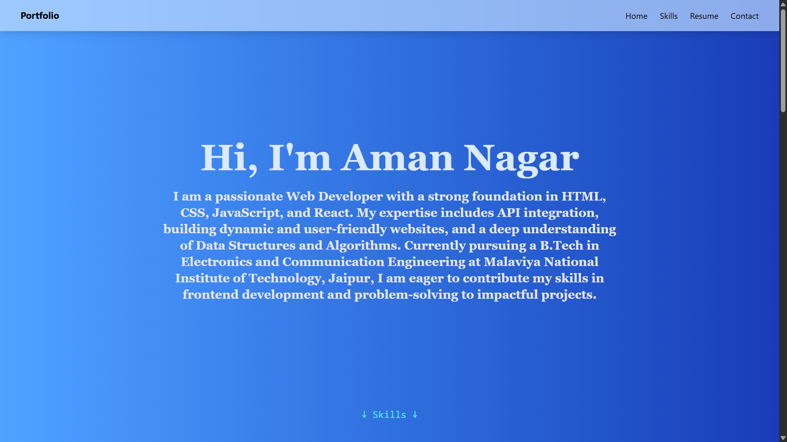
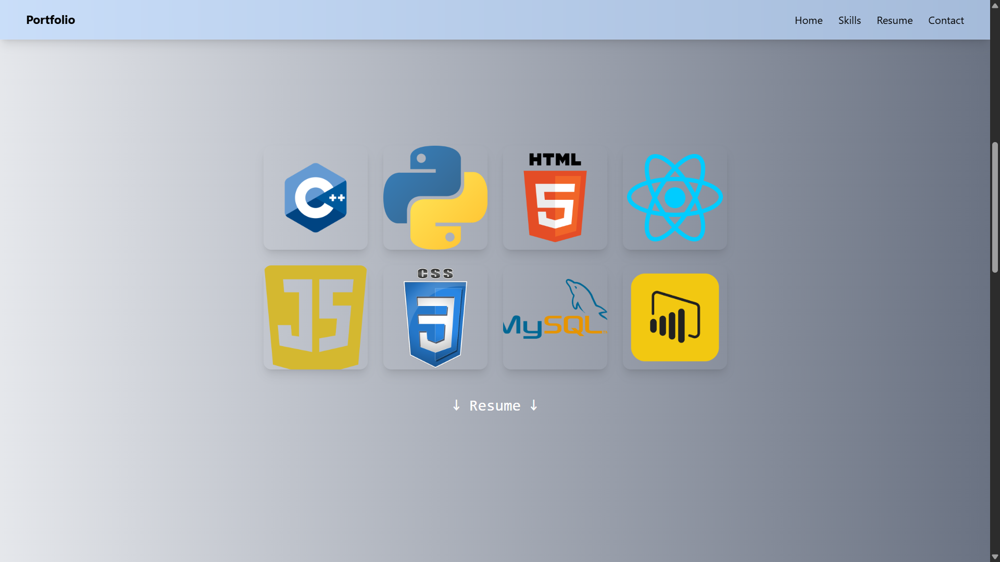
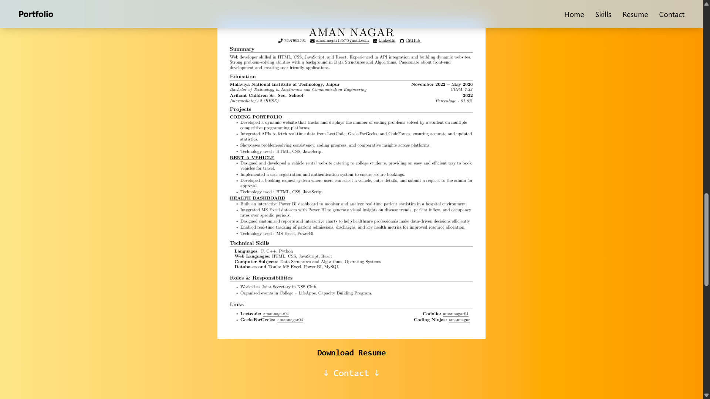
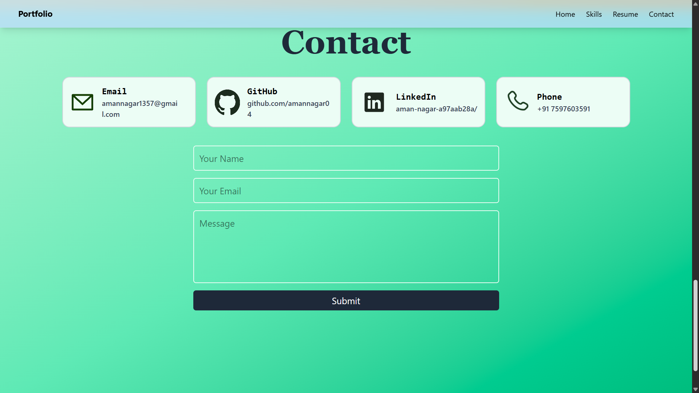

# 🌐 Aman Nagar - Developer Portfolio

This is a fully responsive, single-page portfolio website built using **React** and **Tailwind CSS**. It showcases my skills, resume, and contact information, all styled with a modern UI and optimized for all screen sizes.

---

## 🔧 Tech Stack

- **React.js** – UI framework
- **Tailwind CSS** – Utility-first styling
- **HTML5 & CSS3** – Semantic structure & design
- **Responsive Design** – Mobile-first with Tailwind breakpoints

---

## 📚 Sections

### ✅ `Home`
- Intro and bio
- Responsive text and layout

### ✅ `Skills`
- Displays tools & technologies with icons
- Uses a responsive grid layout
- Fully centered on all devices

### ✅ `Resume`
- Resume preview image
- Download link
- Adaptive height for all screen sizes

### ✅ `Contact`
- Contact cards (Email, GitHub, LinkedIn, Phone)
- Responsive grid with flexible widths
- Contact form with styled inputs

### ✅ `Navbar`
- Fixed at the top with scroll links
- Backdrop blur and shadow for aesthetic

### ✅ `Footer`
- Minimal and clean copyright

---

## 📸 Screenshots

## 🙋‍♂️ Author

**Aman Nagar**

- 📧 [amannagar1357@gmail.com](mailto:amannagar1357@gmail.com)  
- 🔗 [LinkedIn Profile](https://www.linkedin.com/in/aman-nagar-a97aab28a/)  
- 🐙 [GitHub Profile](https://github.com/amannagar04)
